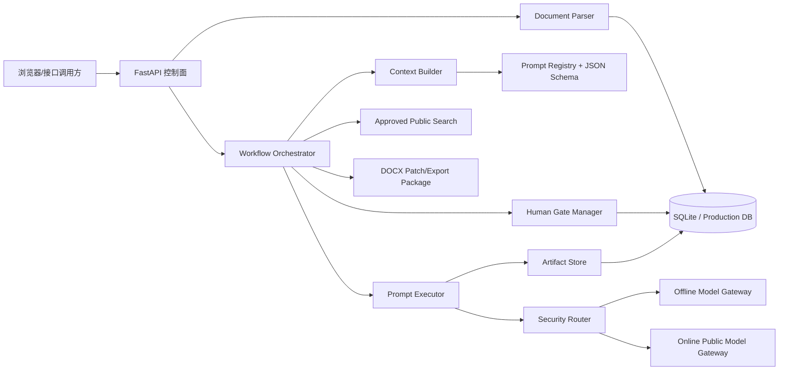
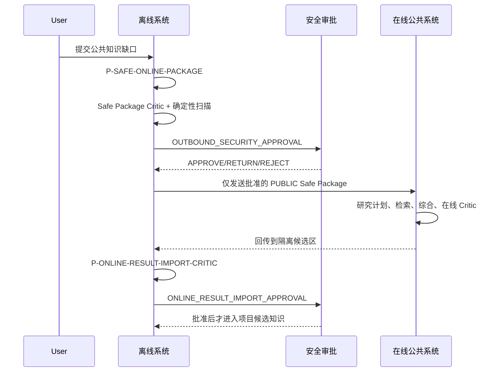
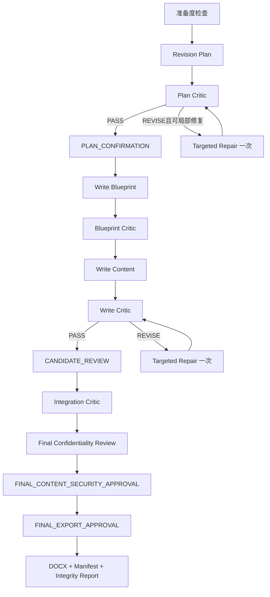

# 系统设计

## 总体架构

## 离线与在线协同

## 申请书编写闭环

## 核心不变量

1. Producer 不能批准自身输出，Critic 不直接修改正式对象。
2. 所有模型输入和输出都必须通过对应 JSON Schema。
3. 低权威来源不能覆盖高权威来源，模型推断不能成为正式事实。
4. UNKNOWN、CONFLICTED、TO_BE_SELECTED 不得被语言流畅性掩盖。
5. 离线模型失败不得自动回退在线模型。
6. 在线结果不能直接成为确认事实或正式正文。
7. 所有 Gate 决定必须匹配上下文 Hash 和所需角色。
8. 最终导出必须同时具备内容保密审批和导出审批。
