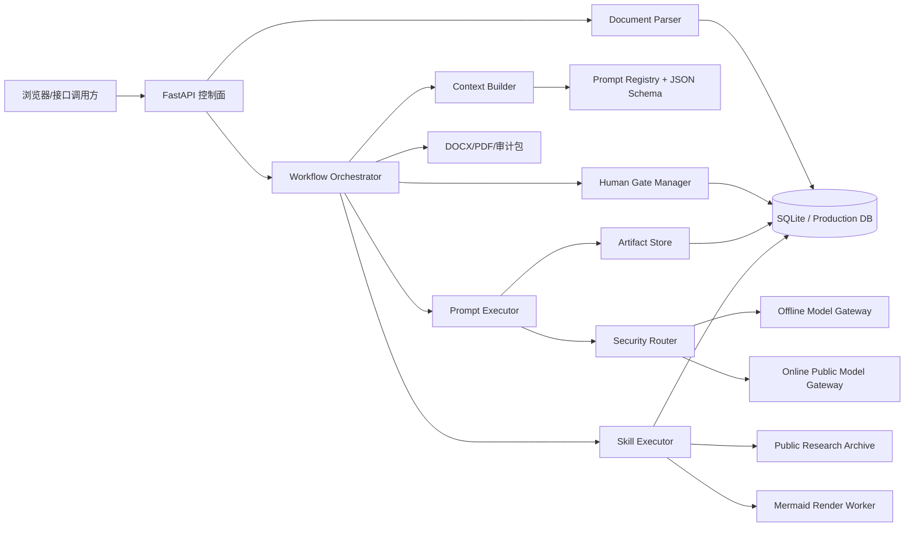
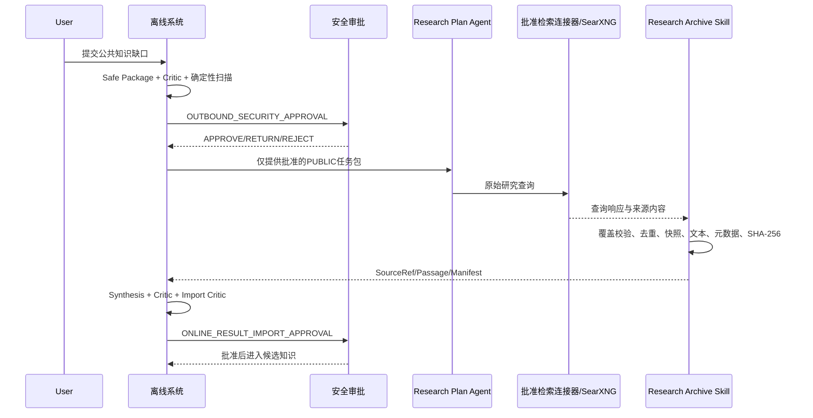
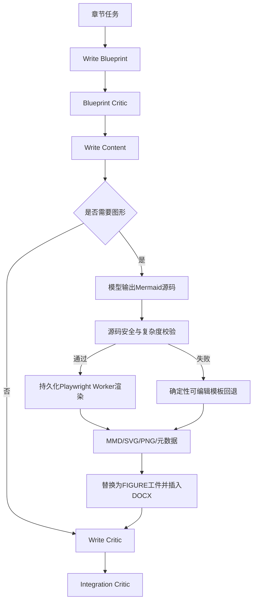
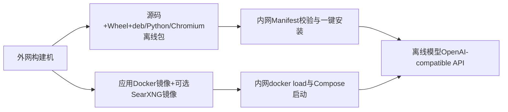

# 系统设计

## 总体架构

## 离线与在线协同

## 弱模型写作与图形闭环

## 离线部署双路径

## 核心不变量

1. Producer 不能批准自身输出，Critic 不直接修改正式对象。
2. 所有模型输入和输出都必须通过对应 JSON Schema。
3. Skill 输入、输出、Hash、状态和错误必须可审计。
4. Public Research Agent 生成的每个原始查询必须有检索响应；缺失时流程失败。
5. 低权威来源不能覆盖高权威来源，模型记忆不能替代归档来源。
6. 离线模型失败不得自动回退在线模型。
7. 在线只接受批准且通过扫描的 PUBLIC 上下文，回传结果先进入隔离候选区。
8. Mermaid 不允许脚本、点击事件、外部CDN或动态初始化，渲染失败必须显式记录并回退。
9. 所有 Gate 决定必须匹配上下文Hash、目标版本和所需角色。
10. 最终导出必须同时具备内容审批和导出审批。
