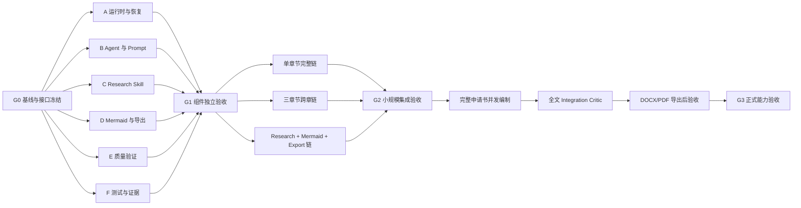

# 申请书智能体系统并发开发与分阶段验证计划

> 状态：规划基线，尚不表示下述能力已经实现或通过验收。
>
> 基线：`main` / `ac7e3032a51c682c6bee6e2461d3393cc14835d7`
>
> 目标：以可恢复、可审计、可并行的方式完成 v0.6 智能体系统的修复、独立组件验证、小规模集成和完整申请书验收。禁止再采用“单个临时容器中串行手工跑完整链路”的脆弱方式。

## 1. 核心原则

1. **并行开发，少量串行关卡。** 运行时、Agent/Prompt、Research Skill、Mermaid/导出、质量验证和测试证据六条轨道并行推进；只有公共基线、接口冻结、小规模集成和正式验收属于硬依赖关卡。
2. **阶段未验收，不进入下一关。** 每个工作包必须留下代码、测试、日志、Trace、验收报告和恢复包。
3. **真实能力测试不得被替代。** `SIMULATED`、`MOCK`、`REPLAY`、固定答案、自动响应器和程序化正文拼装只能用于编排回归，不能作为模型语义能力证明。
4. **模型原始响应不可被改写。** LIVE 能力验收仅允许 JSON 解析、Schema 校验和哈希记录；不得用后处理脚本替换正文或补写语义字段。
5. **安全链路冻结。** 除专门的安全模块任务外，不修改安全分类、密级映射、外发 Gate、审批状态或 WF-1 安全流程。业务测试复用已经批准的检查点，避免重复触发安全检查。
6. **缺失事实必须显式标记。** 对缺失成果、指标、团队信息和基线数据使用 `UNKNOWN` 或 `USER_ASSERTED`，不得编造。
7. **每项修复立即持久化。** 修复完成后必须先测试、提交、记录证据，再继续下一项；不得只保留在聊天记录或临时容器。

## 2. 总体依赖图



## 3. 六条并行开发轨道

### 轨道 A：运行时、真实模型调用与断点恢复

**所有者目录建议：** `app/model_gateway.py`、`app/context.py`、`app/executor.py`、`app/workflows.py`、`app/repository.py`、`scripts/capability_*`

| ID | 工作包 | 主要输出 | 验收标准 |
|---|---|---|---|
| A1 | LIVE 文件桥接或正式模型 Gateway | 请求目录、响应目录、Gateway 实现 | 每次调用保存完整 Prompt、输入 JSON、原始响应文本、解析对象、模型标识、时间戳和哈希 |
| A2 | 无 Replay 的能力上下文 | Schema 脚手架、真实材料注入 | LIVE 模式不读取 Replay；任何未替换占位字段直接 BLOCK |
| A3 | 原始响应保护 | 请求/响应哈希校验 | 原始文本、解析对象和对象哈希不一致时拒绝消费；禁止正文覆盖 |
| A4 | 幂等消费与状态恢复 | 恢复策略、唯一调用键 | `RUNNING`、`WAITING_GATE`、`BLOCKED` 均能从正确步骤恢复，不重复生成工作流或消费响应 |
| A5 | 故障注入 | 进程中断测试 | 在请求前后、数据库事务前后、Critic/Repair/Gate/Export 节点强制退出后可恢复 |
| A6 | 能力验收模式硬门 | 能力运行工厂 | 能力验收拒绝 `SIMULATED`、`MOCK`、`REPLAY`、自动响应器和样例章节回退 |

### 轨道 B：Agent、Prompt 与论证生成内核

**所有者目录建议：** `proposal_prompt_pack_v2/prompts/`、`schemas/`、Agent Profile 与质量规则

| ID | 工作包 | 主要输出 | 验收标准 |
|---|---|---|---|
| B1 | Scheme Agent | 指南规则包 | 只提取来源可支持的规则；外推内容由 Critic 发现 |
| B2 | Project Definition Agent | 事实图、关系图、Proposal Contract | 关系类型和方向合法；缺失成果不被编造 |
| B3 | Fact Agent | 原子事实库 | 一条记录只含一个可判真命题；主体、时间、数字、限定词和来源完整 |
| B4 | Argument Architecture Agent | 唯一中心命题、研究问题和论证图 | 目标—任务—方法—实验—指标闭环；不机械复制旧目录 |
| B5 | Blueprint Agent | 段落级蓝图 | 每段包含具体判断、证据、推理、前后衔接、禁写内容和句群结构；禁止空泛“信息单元” |
| B6 | Content Agent Profiles | 各章节独立写作 Profile | 背景、目标、内容、路线、创新、实验、基础、结论等章节不共享同一模板话术 |
| B7 | Critic / Repair | 精确 Finding 与一次定向修复 | Critic 引用具体问题句；Repair 只改允许路径；修复后由独立 Critic 复审 |
| B8 | Expression Polish | 语义保持型润色 | 不改变事实、数字、引用和结构身份；表格、公式、Mermaid 指令不被压平 |
| B9 | 结论闭环 | Conclusion Profile | 回答全部研究问题、回扣中心命题，不引入前文不存在的新方法、指标或功能 |
| B10 | 主文/附录边界 | 文种分区规则 | Docker、Trace、部署说明等在附录允许，在主文出现时阻断；附录不参与主文重复统计 |

### 轨道 C：Research Skill 与可核验公开资料

**所有者目录建议：** `app/public_research.py`、Research Prompt、来源归档与引用绑定

| ID | 工作包 | 主要输出 | 验收标准 |
|---|---|---|---|
| C1 | 研究计划 | 查询、来源类型、时间范围 | 检索式由研究问题驱动，不是宽泛关键词堆叠 |
| C2 | 真实公开检索 | 原始响应与快照 | 每个来源保存 URL、访问时间、元数据、正文/摘要和 SHA-256 |
| C3 | 去重与权威排序 | 规范化来源库 | 同源重复去除；官方标准、论文、项目页面等按来源类型排序 |
| C4 | Claim 绑定 | `PUBLIC_CLAIM` 与证据 | 正文命题可回溯到来源；原文、摘要和模型综合严格区分 |
| C5 | 最近工作与基线覆盖 | 研究差距证据 | 创新点必须有最近工作、局限机制和可比较基线支持 |
| C6 | 异常处理 | 缺失/冲突来源记录 | 来源失效、内容冲突或证据不足时保留不确定性，不生成虚假 DOI 或题名 |

### 轨道 D：Mermaid、图表、DOCX/PDF 与交付物生成

**所有者目录建议：** `app/mermaid.py`、`app/exporter.py`、`app/delivery_validator.py`

| ID | 工作包 | 主要输出 | 验收标准 |
|---|---|---|---|
| D1 | Mermaid 渲染 | `.mmd`、SVG/PNG、哈希 | 论证架构图、技术路线图、系统架构图均可重复渲染 |
| D2 | 图形协议 | 图指令解析器 | 连续多个图指令不会合并；缺图直接阻断；绝对路径不进入文档 |
| D3 | DOCX 导出 | 最终清稿 | 仅导出通过 Expression Critic 的版本；标题、列表、表格、公式、引用完整 |
| D4 | PDF 转换 | PDF 与日志 | LIVE 环境中转换结果可复核，失败不静默降级 |
| D5 | 交付物结构验证 | DOCX/PDF Findings | 检出空小节、缺章、编号错误、占位值、内部运行术语、引用错位和异常表格 |
| D6 | 页面视觉验证 | 页面截图与视觉 Findings | 检出裁切、重叠、过小图形、不可读表格、异常留白和公式渲染失败 |

### 轨道 E：质量门、全文审查与责任路由

**所有者目录建议：** `app/quality.py`、Integration Critic、质量矩阵

| ID | 工作包 | 主要输出 | 验收标准 |
|---|---|---|---|
| E1 | 确定性质量门 | 结构与事实规则 | 在模型自评之外检查关系矩阵、事实原子性、指标依据、来源完整性和文种漂移 |
| E2 | 章节质量门 | Profile 专用规则 | 不同章节检查不同职责，不以统一“高分模板”放行 |
| E3 | 跨章一致性 | 中心命题、术语和映射检查 | 目标、研究内容、关键问题、技术路线、实验和指标能够互相映射 |
| E4 | Integration Critic | 全文 Finding | 读取完整候选集合；检查重复、冲突、遗漏、结论闭环和创新证据 |
| E5 | 导出后责任路由 | Finding → 原责任 Agent | 写作问题回 WF-4 具体章节；导出器缺陷标为工程错误，不让 Agent 改正文掩盖 |
| E6 | P0/P1 关闭机制 | Finding 生命周期 | 所有 P0/P1 必须通过修复和复审关闭，禁止手工改数据库放行 |

### 轨道 F：测试、CI、证据与可恢复交付

**所有者目录建议：** `tests/`、`.github/workflows/`、`recovery_evidence/`、开发文档

| ID | 工作包 | 主要输出 | 验收标准 |
|---|---|---|---|
| F1 | 单 Agent 测试矩阵 | 正向/负向/边界 Fixtures | 每个 Agent 至少 3 个正向、5 个负向、1 个边界、1 个重启用例 |
| F2 | 工作流故障注入 | 重启恢复报告 | 各中断节点恢复后 Prompt 数量、数据库对象和最终结果一致 |
| F3 | Prompt Pack 一致性 | 自动 Manifest | Prompt、Schema、Replay、Gate 和目录数量由注册表生成，漂移时 CI 失败 |
| F4 | Trace 审计 | 调用证据包 | 每次调用输入、原始输出、哈希、状态、耗时和责任 Agent 完整 |
| F5 | 阶段恢复包 | 源码、数据库、材料、日志压缩包 | 在新容器中可恢复并继续运行 |
| F6 | CI 并发矩阵 | 多 Job 工作流 | 六条轨道测试并行执行；Integration Job 仅在全部轨道通过后运行 |

## 4. 必须串行的阶段 Gate

### G0：基线与接口冻结

必须先完成：

- 固定唯一 Git 基线和版本；
- 冻结 Prompt/Schema、Agent 责任、状态机和 Artifact 接口；
- 建立 Git、SQLite、Trace 和恢复包目录规范；
- 明确安全链路冻结范围。

**通过条件：** 在全新环境中能够恢复源码、依赖、材料和基线测试。

### G1：组件独立验收

六条轨道可以并行开发，但进入集成前必须分别通过独立验收。

**通过条件：** 每个组件均有正向、负向、边界和重启测试；真实模型调用层通过哈希和原始响应审计。

### G2：小规模集成验收

并行运行三组测试：

1. 单章节完整链：Blueprint → Content → Critic → Repair → Polish → Export；
2. 三章节跨章链：背景、研究内容、技术路线；
3. Research + Mermaid + DOCX/PDF 链。

> 实现与验收入口：`app/research_mermaid_export.py`、`scripts/run_s3_research_mermaid_export.py`、`tests/test_s3_research_mermaid_export.py` 和 `docs/S3_RESEARCH_MERMAID_EXPORT_ACCEPTANCE.md`。工程集成验收使用 recorded connector fixture，不冒充 LIVE 检索或模型语义能力证明。

**通过条件：** 不人工修改正文；发现的问题由责任 Agent 自主返修并复审。

### G3：完整申请书能力验收

在完整材料上运行真实模型和真实 Skill：

1. 项目定义与事实库；
2. 真实公开调研；
3. 论证架构；
4. 完整章节规划；
5. 分组并行写作；
6. 分章 Critic/Repair/Polish；
7. 每三章执行跨章审查；
8. 全文 Integration Critic；
9. DOCX/PDF 导出后验收；
10. 自动返修和最终复审。

**通过条件：** 无 Replay/模拟响应、无人工改正文、P0/P1 全部关闭、事实和引用可追溯、图表完整、结论闭环、主文无系统说明书漂移、文档视觉可读、全流程可从检查点重现。

## 5. 正式写作阶段的并发分组

论证架构和 Section Contract 冻结后，章节可以分组并行：

- **组 1：背景与问题**——选题背景、意义、国内外现状、研究差距；
- **组 2：目标与任务**——研究目标、研究内容、关键科学问题；
- **组 3：方法与验证**——技术路线、模型方法、实验方案、指标体系；
- **组 4：实施与保障**——进度、成果、研究基础、保障条件、风险；
- **组 5：图表与引用**——Mermaid、表格、公式、参考文献和交叉引用。

同一章节内部必须保持串行：

```text
Blueprint → Blueprint Critic → Targeted Repair（最多一次）
→ Content → Content Critic → Targeted Repair（最多一次）
→ Expression Polish → Expression Critic
```

章节之间不得共享可变草稿对象。每章使用独立 `section_id`、版本号、修复额度和 Trace；跨章一致性由 Integration Critic 统一处理。

## 6. Git、分支与工作树约定

### 6.1 建议分支

- `agent/runtime-recovery`：轨道 A；
- `agent/prompt-agents`：轨道 B；
- `agent/research-skill`：轨道 C；
- `agent/mermaid-export`：轨道 D；
- `agent/quality-validation`：轨道 E；
- `agent/test-evidence`：轨道 F；
- `agent/integration-v06`：只用于通过 G1 后的集成。

每条分支使用独立 Git worktree，避免多轨道修改同一工作目录。

### 6.2 提交粒度

一个提交只解决一个可验证问题，并包含：

- 代码或 Prompt 修改；
- 对应测试；
- 必要的 Fixture/Schema 更新；
- 简短的验收证据。

禁止把大量不相关修改压成一个“完成全部修复”的提交。

### 6.3 合并规则

- 轨道分支只有在本轨道测试通过后才能进入集成；
- `agent/integration-v06` 必须运行全部轨道测试和小规模 E2E；
- 不在功能分支修改安全链路，除非任务明确属于安全模块；
- 合并后立即生成源码、数据库、测试日志和 Trace 恢复包。

## 7. 文件责任边界与冲突控制

为降低并行开发冲突，每条轨道拥有明确的首要修改权：

| 文件区域 | 首要轨道 | 其他轨道规则 |
|---|---|---|
| 模型 Gateway、Context、Executor、恢复逻辑 | A | 通过接口扩展，不直接重写 |
| Prompt、Schema、章节 Profile | B | Schema 变更必须通知 A/E/F |
| 公共研究与来源归档 | C | 不直接修改写作逻辑 |
| Mermaid、Exporter、Delivery Validator | D | 不直接改变事实或论证结构 |
| Quality Gate、Integration Critic | E | 不改写模型输出，只生成 Finding 和路由 |
| Tests、CI、Manifest、Evidence | F | 不放宽生产规则以迁就测试 |

涉及公共接口时先更新契约文档和 Schema，再由相关轨道分别实现；禁止两个轨道同时修改同一核心函数。

## 8. CI 并发矩阵

建议 GitHub Actions 使用并行 Job：

```text
lint-and-schema
runtime-recovery-tests
agent-prompt-tests
research-skill-tests
mermaid-export-tests
quality-validation-tests
trace-and-recovery-tests
```

全部通过后才运行：

```text
small-e2e-single-section
small-e2e-three-sections
small-e2e-research-mermaid-export
```

正式完整申请书运行不作为每次提交的普通 CI，而作为带固定输入材料、固定模型配置、完整 Trace 和人工启动 Gate 的能力验收任务。

## 9. 持久化与审计要求

每个阶段必须保存：

```text
source_commit.txt
environment_manifest.json
input_material_manifest.json
workflow_checkpoint.sqlite
requests/
responses/
prompt_traces/
research_archive/
mermaid_artifacts/
exports/
test_logs/
acceptance_report.md
recovery_bundle.zip
```

每完成一次 Agent 调用：

1. 请求先落盘；
2. 原始响应单独落盘；
3. 校验通过后再写数据库；
4. 数据库事务完成后写消费标记；
5. 定期生成恢复包；
6. 重要修复立即 Git 提交。

## 10. 时间计划（并行执行）

| 阶段 | 墙钟时间估计 | 说明 |
|---|---:|---|
| G0 基线和接口冻结 | 0.5 天 | 公共前置，必须先完成 |
| 六轨组件开发与独立验证 | 1—3 天 | A—F 并行推进 |
| G2 小规模集成 | 1—2 天 | 三组集成测试并行运行 |
| 完整申请书能力验收 | 1—3 天 | 章节分组并行，章节内部串行 |
| 合计 | **4—9 天** | 不含材料严重缺失或需要重构安全链路的情况 |

时间估计以具备并行执行资源、模型和检索端点可用、输入材料完整为前提。若只能在单个对话中手工逐次转运所有模型请求，墙钟时间会增加，但开发和测试架构仍按本计划并行拆分。

## 11. 近期执行顺序

1. 完成 G0：核实主分支、冻结接口、建立阶段恢复包；
2. 同时创建六条轨道分支和 worktree；
3. 优先完成 A1—A4、B5—B9、D2—D5、E1—E5 和 F1—F4；
4. 各轨道分别提交独立验收报告；
5. 进入 `agent/integration-v06`，并行执行三组小型 E2E；
6. 小型 E2E 通过后，才启动完整材料正式验收。

## 12. 完成定义

本计划完成不等于“生成了若干页文本”。系统只有同时满足以下条件，才可宣称具备独立生成合格申请书的能力：

- 真实模型完成所有语义 Agent 调用；
- 无 Replay、模拟响应或程序化正文替换；
- Agent、Skill、工作流和导出器均通过独立与集成测试；
- 中断后能够从检查点恢复；
- Research 来源真实、可核验、可追溯；
- Mermaid、表格、公式和引用完整；
- Critic 能自主发现并路由修复实质问题；
- 最终 DOCX/PDF 通过结构、内容和视觉验收；
- 无人工直接修改正文以掩盖系统缺陷；
- Git 历史、数据库、Trace、测试日志和恢复包完整可重现。
