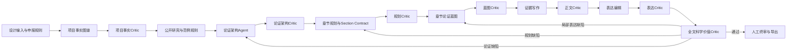

# 项目申请书智能体系统 v0.6
## Trace根因分析、底层重构与验收报告

## 1. 目标与结论

本轮工作的目标不是修补某一份物流运输申请书，而是根据该申请书的真实运行Trace，重构项目申请书智能体系统，使其不再把“流程跑通、篇幅足够、章节齐全、图表很多、Trace完整”误判为“申请书质量合格”。

结论：此前已识别的结构性缺陷已经分别落实为知识图谱约束、Prompt职责、Schema契约、工作流路由和不依赖模型自评的质量校验。历史Trace负向重放和新设计输入正向运行形成了双向证据：

- 历史审计包共有239份Prompt Trace；其中167份与申请书质量直接相关；新版规则对167份全部作出需要修订或终止当前阶段的判断，解析错误为0。
- 新版正向端到端运行完成五条工作流、108次Prompt调用和14个章节；每章均经过章节论证、证据写作、章节审查、表达编辑和表达审查；全文审查收到14/14章节并通过12项质量维度。
- 正向运行中，重复段落、重复句式、重复信息键、非中心命题过度集中和同构表达组均为0。
- 全量自动测试45项全部通过（最终测试结果以交付清单为准）。

这意味着：系统不会再对历史申请书中已经发现的同类缺陷给出无证据的合格判断。真实大模型的原创性、学术判断和领域能力仍需用用户实际模型与真实项目材料继续测评，但模型输出不合格时，系统将明确暴露问题并路由到对应阶段，而不是以形式指标掩盖。

## 2. 历史Trace显示的责任链

### 2.1 关键量化事实

| 阶段 | 历史运行事实 | 说明 |
|---|---:|---|
| 项目定义 | 1个OBJECTIVE、0条关系 | 一个目标被当成完整项目知识图谱 |
| 准备度审查 | 1个可写Profile、0个缺失输入 | 未检查关键对象类型是否缺失，错误判定READY |
| 修改计划 | 54个目标章节、54个任务 | 以原文标题覆盖和篇幅扩张替代论证规划 |
| 章节正文审查 | 54次中54次 `checked_paragraph_ids` 为空 | Critic没有逐段读取正文 |
| 章节审查维度 | 最高仅2项 | 未检查方法、创新、基础、指标和章节独特性 |
| 全文审查 | 仅收到1个候选章节，文档映射却有54章 | 实际未审全文，却给出整体结论 |
| 全文质量维度 | 0项 | 没有科学价值层面的全文Scorecard |

### 2.2 各智能体责任

| 原智能体/组件 | 导致的问题 | 底层原因 |
|---|---|---|
| Project Knowledge Agent | 项目定义极浅，工程目标直接充当研究命题 | 事实抽取、研究论证和可写判断混在一个Prompt中 |
| Project Readiness Critic | 缺少差距、问题、方法、验证和基础仍判READY | 只评分“已有对象”，不检查“必需对象是否缺失” |
| Template Agent | 只学标题、格式、图表和篇幅 | Schema没有论证顺序、段落功能、表达模式和反模式 |
| Planning Agent | 54章同构扩写，正文无限膨胀 | 优化目标是章节覆盖，不是中心命题和论证闭环 |
| Blueprint Agent | 每章复用固定六段式 | 没有Section Profile、章节合同、唯一命题和新增信息键 |
| Content Agent | 技术名称和系统实现被扩写成研究正文 | 段落没有绑定命题、证据和验证责任 |
| Section Critic | 只看结构和Trace存在性 | 没有逐段检查清单、Profile规则和质量Scorecard |
| Integration Critic | 只读1章却宣布全文合格 | Context Builder未保证候选集合完整；Schema不要求12维评价 |
| Context Builder | Critic可能拿到Replay样例而非Producer真实输出 | Producer与Critic Schema不一致时采用静默回退 |
| Workflow Orchestrator | “人工确认”被当成质量修复 | 确认节点没有改变事实、规划或正文，可能形成无效循环 |
| Diagram Enrichment | 标题命中就自动补图，图多但不承担论证 | 图示没有绑定命题、证据、信息键和章节合同 |

## 3. 原问题与新版结构性防线

| 已发现问题 | 新版防线 |
|---|---|
| 写错文种，主文变成智能体系统说明 | Proposal Contract明确主文/附件边界；Section Profile限制职责；全文统计Prompt、Trace、部署等术语漂移 |
| 没有唯一中心命题 | Argument Graph强制恰好1个CENTRAL_PROPOSITION，且必须可比较、可检验、有边界条件 |
| 工程难点冒充科学问题 | 知识图谱区分SYSTEM_REQUIREMENT与RESEARCH_QUESTION；规则明确二者不可替代 |
| 研究现状只罗列文献 | LITERATURE_REVIEW Profile要求最近工作、适用条件、局限机制、差距和研究问题闭环 |
| 方法只有技术标签 | METHOD_AND_ALGORITHM Profile要求形式化模型、变量、目标、约束、算法组件和理论/经验验证路径 |
| 创新只是模块集成 | 每项创新绑定CLOSEST_PRIOR_WORK、LIMITATION_MECHANISM、NOVEL_MECHANISM和验证方式 |
| 研究基础为空泛 | TEAM_EVIDENCE/PRELIMINARY_RESULT只有来自前期成果或技术材料时才能进入SUPPORTED/CONFIRMED |
| 指标数字没有依据 | METRIC_JUSTIFICATION要求基线、条件、数据来源、统计口径和成功判据 |
| 章节过多、主文失控 | Planning Agent必须给出Narrative Architecture、主文页数预算、附件边界和有限Section Contract |
| 各章重复重新开始 | 每章拥有独有论证功能、命题、信息键、前置章节和不可重复章节；Prior Section Digest传递已推进语义 |
| 模板化套话和机器痕迹 | 全文同时计算完全重复、高频句、同构句式骨架、重复信息键和命题过度集中 |
| 图表数量替代论证 | 图示段落必须绑定命题、证据、信息键和章节合同；章节标题不能自动触发插图 |
| Critic没有真正读内容 | 章节Critic必须覆盖全部paragraph_id和Profile acceptance rule；全文Critic必须覆盖完整候选集合 |
| 全文缺陷只做表面改写 | 按最早责任阶段路由：论证问题回论证架构，所有权/依赖问题回规划，纯文字重复才局部重写 |
| 弱模型输入过长 | 单章只传当前合同、局部图谱、相关事实和前文章节语义摘要；全文模型接收语义身份与受限片段，完整正文由确定性质量校验读取并单独存档 |

## 4. 新版底层逻辑

职责分离原则：

1. 项目事实Agent只回答“材料中明确有什么”，不负责宣布项目可写。
2. 论证架构Agent回答“为何值得研究、研究什么、如何验证”，不写正文。
3. Planning Agent只把已通过审查的论证架构映射为章节合同，不创造事实和研究命题。
4. Blueprint Agent决定一章如何推进论证，不负责最终措辞。
5. Evidence Writing Agent按段落合同写内容，不擅自改变命题和证据。
6. Expression Agent只改善表达，不改变语义身份。
7. Critic与Producer分离，并由程序校验Critic是否真正检查了要求的对象。

## 5. 知识图谱重构

### 5.1 从单一项目对象表改为双图谱

- 项目事实图：记录材料中可确认的需求、场景、问题、目标、任务、方法、数据、实验、成果、指标、基础和资源。
- 申请书论证图：记录中心命题、研究差距、研究问题、最近工作、局限机制、假设、形式化模型、算法、理论性质、创新机制、实验、基线、消融、成功判据、前期证据和贡献。

关键约束：

- 中心命题：恰好1个；
- 研究问题：1—4个；
- 核心任务：2—5个；
- 每项创新至少绑定1个最近工作；
- 每个主要论断至少绑定1条证据；
- 研究基础至少有1项合格前期证据；
- SYSTEM_REQUIREMENT不得替代RESEARCH_QUESTION；
- 原型系统不得自动视为研究创新；
- Trace存在不得替代证据有效。

### 5.2 新增章节合同

每章必须具有：

- `profile_id`：章节类型；
- `argument_function`：本章在全文中的唯一论证功能；
- `must_advance_claim_ids`：本章必须推进的命题；
- `must_use_evidence_ids`：必须使用的证据；
- `unique_information_keys`：本章独占的新增信息；
- `required_argument_roles`：段落功能组合；
- `prerequisite_section_ids`：前置章节；
- `must_not_repeat_section_ids`：不得重复的章节；
- `max_overlap_ratio`与`word_budget`；
- `placement`：主文、附件或省略；
- `acceptance_rules`：本章专用验收规则。

## 6. Schema重构

主要新增或修改：

- `argument_graph.schema.json`
- `proposal_contract.schema.json`
- `section_contract.schema.json`
- `prior_section_digest.schema.json`
- `quality_scorecard.schema.json`
- `paragraph.schema.json`
- 30个Prompt的60份输入/输出Schema

段落不再只是文本，而必须携带：

- `primary_claim_id`
- `evidence_ids`
- `novel_content_key`
- `section_contract_id`
- `trace_link_ids`

这使得“本段在说什么、依据什么、提供了什么新信息、属于哪一章的责任”能够由程序检查，而不是依赖模型自觉。

## 7. Prompt重构

Prompt由26个扩展为30个，新增：

- `P-ARGUMENT-ARCHITECTURE`
- `P-ARGUMENT-ARCHITECTURE-CRITIC`
- `P-EXPRESSION-POLISH`
- `P-EXPRESSION-CRITIC`

全部Prompt统一恢复：

- 角色与权限；
- 必须读取的输入；
- 执行步骤；
- 专用规则；
- PASS/REVISE/NEED_USER_INPUT/BLOCK判定；
- 可定位Finding；
- 强制自检；
- 严格输出Schema。

关键原则：

- 缺少证据时保留UNKNOWN或要求补充，不得为了语言完整生成事实；
- 参考申请书只能影响结构、逻辑和表达，不得作为本项目事实；
- 人工确认只能确认事实和范围，不能把未通过质量检查的文本直接改成PASS；
- 修改意见必须进入下一轮对应Producer输入，不能只“重新运行一次”。

## 8. 三轮以上迭代结果

### 第一轮：阻止历史错误继续通过

- 新增项目图谱完整性、真实来源、研究问题/工程需求区分、虚假准备度、文种漂移和全文候选完整性校验。
- 结果：历史Trace在项目定义、准备度、规划、蓝图、正文和全文阶段均被识别为不合格。

### 第二轮：重构生产链路

- 新增论证架构与表达编辑阶段；
- 统一Producer与Critic输入契约；
- 新增Section Profile、Section Contract和12维Scorecard；
- 禁止Context Builder静默保留Replay样例。

### 第三轮：解决跨章节重复和无效修订

- 将命题、证据、信息键和章节合同写入段落Schema；
- 前文章节仅传结构化语义摘要；
- 全文缺陷按最早责任阶段回退；
- 人工确认不再代替质量修复。

### 第四轮：弱模型与图示质量

- 单章上下文从约108 KB降至约33—38 KB；
- 全文模型输入与完整质量上下文分离，实际模型输入约88 KB，完整159 KB内容仍由程序审查并存档；
- 模型只处理有界文本和语义身份；
- 图示只有在蓝图存在明确图示意图并绑定命题、证据、信息键和章节合同时才允许自动渲染或模板回退。

## 9. 验证结果

### 9.1 历史Trace负向重放

- Trace总数：239；
- 质量相关Trace：167；
- 被新版规则判定需要修订/终止：167；
- 解析错误：0。

高频发现包括：

- 108次章节推进摘要与段落语义身份不一致；
- 54次正文Critic未读取全部段落；
- 54次Critic维度过浅；
- 54次未执行Profile规则；
- 53次章节Profile错误；
- 50次主文漂移为系统说明；
- 45次蓝图信息键重复；
- 40次所有段落只使用同一来源；
- 39次章节内部重复；
- 34次通用六段式蓝图。

### 9.2 新版正向端到端

- 五条工作流：全部完成；
- Prompt调用：108次；
- 正式章节：14章；
- 章节蓝图/蓝图Critic/正文/正文Critic/表达编辑/表达Critic：各14次；
- 全文候选：14/14；
- 全文质量维度：12/12通过；
- 完全重复段落组：0；
- 高频句组：0；
- 同构句式组：0；
- 重复信息键：0；
- 非中心命题过度集中：0；
- DOCX导出：成功。

### 9.3 静态与自动测试

- Prompt注册项：30；
- Replay：150组；
- 合法输入/输出：120组；
- 故意错误输入：30组；
- Prompt Pack校验：PASS；
- Python编译：PASS；
- pytest：45项全部通过（最终结果以测试日志为准）。

## 10. 能否有效规避原申请书问题

对已经识别的结构性问题，答案是“可以形成有效约束”，理由不是Prompt写得更长，而是：

1. 每类问题都有明确责任阶段和可机器验证的数据结构；
2. 历史错误输出无法通过新版规则；
3. 新版正向链路能够自己生成并通过，不是一个只会否定的审查器；
4. 全文问题会回到最早能够真正修复它的阶段；
5. 弱模型不能靠泛化套话或省略检查对象获得合格判断。

不能诚实承诺的是：任意真实LLM、任意领域和任意输入材料都一定产生高水平原创研究思想。系统能够保证的是：

- 材料不足时明确暴露缺口；
- 模型输出违反已知质量规则时不作合格判断；
- 所有结论、修订和质量判断可追溯；
- 不再用页数、图表、引用和Trace数量替代科研论证质量。

后续生产验收还应使用用户计划部署的真实离线模型，对同一组设计输入执行多模型对照，测评Schema遵循率、论证质量、修订收敛率和人工接受率。这属于模型选型与生产验收，不是当前底层架构缺失。
