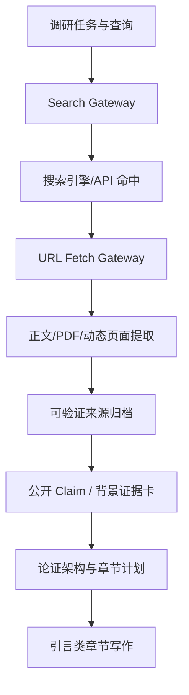
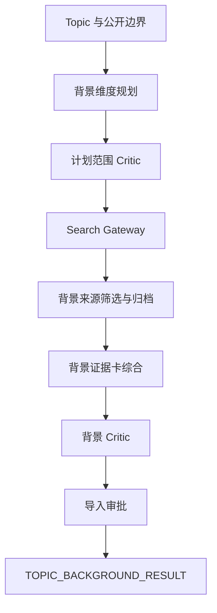

# Proposal Agent：搜索能力与 Topic 背景调研工作流更新计划

创建日期：2026-09-01
状态同步：2026-09-03
审计基线：`7589a674-1f87-47e8-a096-8c5da0a81f56.zip` + `workflow_oneclick_frontend_combined_gitapply_no_ps1_20260831.patch` + `wf4_critic_review_graph_closure_checkpoint_20260901.patch`

## 0. AI 接手摘要（以本节为当前状态准绳）

### 0.1 当前 Git 与工作区状态

- Phase 0/1 技术基线提交：`28bb520 feat(search): extract search fetch and content contracts`。
- Phase 0/1 说明提交：`03e15ec docs(search): record phase zero and phase one baseline`。
- Phase 2 已完成实现、范围验收并提交：`7a4e8fd update phase 2 (playwright and search fallback)`。
- Phase 2 详细实施证据 `docs/SEARCH_BACKGROUND_PHASE2_REPORT_20260902.md` 已包含在 `7a4e8fd` 中。
- Phase 3 已完成实现、范围验收并提交：`f53e98b update phase 3 (wf3 retrieval execution contract and channel sufficiency)`；详细实施证据 `docs/SEARCH_BACKGROUND_PHASE3_REPORT_20260903.md` 已包含在 `f53e98b` 中。
- `docs/video_demo_20260902/` 是用户本地视频材料，已被 `.gitignore` 排除且未进入任何技术提交，**不得强制暂存、提交、删除或混入技术补丁**。
- `data/capability_tests/` 和 `data/browser_cache/` 已加入 `.gitignore`；真实能力 receipt 保留在本地，但不会误入 Git。
- Phase 3 提交前已执行 `git status --short` 与 `git diff --cached --name-only` 核对；接手者提交前仍须执行同样检查。

### 0.2 用户明确要求与不可突破的边界

1. 不要把“数据库 Schema”和“Prompt JSON Schema”混为一谈。允许修改 Prompt、Prompt JSON Schema、Model Schema、Prompt Registry、`workflow_defs`、`workflows`、context、dependency preflight、UI、Replay 和测试。
2. 原则上复用现有数据库表；如果后续确实必须修改数据库结构，必须先说明具体原因，不能自行扩表。
3. 独立 WF-3B 必须使用正式的新工作流类型、新 Prompt 和新 Schema；禁止伪装复用 `PUBLIC_RESEARCH` 类型或以 sidecar 形式绕过类型边界。
4. Browser Search 不能成为唯一搜索来源。必须保留 Academic API、SearXNG、Connector/Recorded 和可配置 provider；Playwright 仅承担真实搜索引擎补充及动态网页读取兜底。
5. 真实验收必须证明至少一个 Web Search 通道实际生效；禁止用纯 Academic 结果掩盖网页通道失败。
6. 必须保留当前工作区全部既有修改；禁止覆盖、回退或清理不属于本任务的用户文件。
7. 未经用户再次明确授权，不运行 LIVE MiniMax 或其他 LLM。允许并应优先运行不调用 LLM 的真实 Search/Fetch capability test。
8. 修复应保持确定性边界：provider 选择、运行时 ID、Hash、Coverage、状态、路由和安全判断由代码负责，不要求模型生成。
9. 后续实施严格按 Phase 3 → Phase 4 → Phase 5 → Phase 6 推进；每一阶段单独验收，不把 WF-3、WF-3B 和 WF-4 一次性混改。

### 0.3 已完成状态

| Phase | 状态 | 结果 |
|---|---|---|
| Phase 0 | 已完成 | 基线冻结、Hash/checkpoint 和既有全量失败分类已记录 |
| Phase 1 | 已完成并提交 | Search/Fetch/Extract 契约抽离，旧 provider 与 WF-3 行为兼容 |
| Phase 2 | 已完成并提交 | Browser Search、Playwright Worker、动态读取兜底、安全、缓存、限速、preflight 和真实 Web Search 验收；提交 `7a4e8fd` |
| Phase 3 | 已完成并提交 | WF-3 检索执行合同（Plan 2.2.0 五字段）、provider channel/profile、required web channel 阻断语义、三级充分性 evidence_funnel；提交 `f53e98b` |
| Phase 4 | 未开始 | 正式独立 WF-3B 背景调研工作流 |
| Phase 5 | 未开始 | WF-3B → WF-4 的背景证据确定性路由与 lineage |
| Phase 6 | 未开始 | 完整回归、恢复测试和经授权的小规模 LIVE LLM 验收 |

### 0.4 Phase 2 已实现的代码能力

- 新增 `app/skills/browser_worker.py`：Playwright 延迟加载、单批次 Browser Context 复用、按 origin 限速、TTL 磁盘缓存、关闭释放。
- 新增 `app/skills/search_providers/browser_search.py`：正式 provider ID 为 `browser_search`，兼容配置别名 `browser`，保存原始搜索结果页和每次查询 receipt。
- `HttpFetchGateway` 改为手动、受控地跟随 HTTP 重定向；原始 URL、重定向每一跳和最终 URL 都先做公网地址检查。
- 浏览器导航前、最终 URL 及所有子请求均执行 HTTP(S)/公网地址检查；拒绝回环、私网、链路本地、保留/组播地址和 URL credentials。
- 静态 HTML 为 `EMPTY`、`SHORT` 或 JS shell 时进入 Playwright；成功标为 `PLAYWRIGHT_RENDERED`。
- CAPTCHA、登录墙、403、429、超时、导航错误和动态提取失败均分类记录，不绕过验证。
- 浏览器仍失败时只归档搜索摘要并标为 `SNIPPET_ONLY`；此类记录不进入可引用 `sources/passages`，不计入 Coverage。
- hybrid 现有路径在 SearXNG 无命中/失败且浏览器开关启用时可进入 Browser Search fallback；这只是 Phase 2 能力接入，不等同于 Phase 3 required channel 合同已经完成。
- 新增配置、dependency preflight、配置状态输出和无 LLM capability 脚本。

### 0.5 Phase 2 验收证据

- Search/Fetch、dependency preflight、WF-3 相关范围回归：`214 passed in 8.91s`（此前同范围复验为 `214 passed in 9.55s`）。
- 本批 Python 文件 Ruff：`All checks passed`。
- Python `compileall`：通过。
- `git diff --check`：通过，仅有仓库既有 CRLF/LF 提示。
- 当前 Python 环境已安装仓库锁定版本 `playwright==1.57.0`；系统浏览器使用 `C:\Program Files (x86)\Microsoft\Edge\Application\msedge.exe`。
- 无 LLM 真实 Web Search 最终结果：`PASS`、`llm_invoked=false`、Brave Search HTTP 200、5 条真实网页命中。
- 最终 receipt：`data/capability_tests/web_search/20260902T112128.018504_0000/capability_receipt.json`。
- 原始结果页：`data/capability_tests/web_search/20260902T112128.018504_0000/raw_search_pages/CAPABILITY-WEB-001-browser-search-8a666bf067f340d9.html`。
- 原始 HTML SHA-256：`8c4a027242a0fc877af29884695d72e1107b68f1362d284678702f862690e371`。
- 测试过程中的 Bing CAPTCHA、DuckDuckGo 超时和一次异常 DNS 保留地址均被明确判为失败，未伪装为搜索成功。

### 0.6 已知但不属于 Phase 2/3 的基线问题

- 全量测试仍存在 Phase 0/1 已记录的 Argument `candidate.review_units` 历史契约失败、G0 冻结身份漂移、旧 provenance/semantic closure/quality guard 断言，以及 Full Integration 超时级联。
- 最新全量尝试首个失败仍是 `tests/test_argument_lifecycle_composition_v9.py::test_v9_argument_repair_paths_are_relative_to_producer_result` 的 `KeyError: review_units`；Phase 2/3 未修改 Argument、WF-4 或其 Model Schema。
- `tests/test_runtime.py::test_runtime_recovers_safe_package_scalar_source_ref_drift_without_model_call` 在干净 HEAD（`7a4e8fd`）上同样失败，属既有基线问题，与 Phase 3 无关（已用 stash 复验）。
- 不得为了让范围测试看起来全绿而顺手修改上述非搜索问题。应以 227 项范围回归和既有基线报告进行差异判断。

### 0.7 下一位接手者的第一组操作

1. 先阅读本节、`docs/SEARCH_BACKGROUND_PHASE2_REPORT_20260902.md` 和 `docs/SEARCH_BACKGROUND_PHASE3_REPORT_20260903.md`。
2. 执行 `git show --stat f53e98b` 核对 Phase 3 提交，并执行 `git status --short` 确认没有新的非计划修改。
3. 重跑 227 项范围测试和 `scripts/check_web_search_capability.py`；真实公网偶发 CAPTCHA/DNS/超时必须保留为真实失败，不能放松私网安全规则或伪造 PASS。
4. 不重写或拆散 `7a4e8fd`/`f53e98b`；提交后续计划/代码时继续显式排除 `docs/video_demo_20260902/` 和 `data/` 运行证据。
5. Phase 3 提交稳定后再开始 Phase 4；WF-3B 必须使用正式的新工作流类型、新 Prompt 和新 Schema。

## 1. 结论

本次更新不能只做两项表面修改：

1. 在现有 WF-3 中增加一个 Playwright 调用；
2. 再复制一份“调研 Prompt”作为背景工作流。

真正需要闭合的是两条数据链：

推荐保留现有 `WF-3_HYBRID_ONLINE_ASSIST`，将它升级为可靠的技术/文献调研工作流；新增独立的 `WF-3B_TOPIC_BACKGROUND_RESEARCH`，专门获取当前 topic 的应用场景、现实需求、政策与行业背景、规模趋势、代表案例和应用约束。两者共用检索与归档内核，但使用不同的调研契约、充分性规则和下游路由。

## 2. 已核实的当前实现

### 2.1 当前已经存在的能力

- `WF-3_HYBRID_ONLINE_ASSIST` 已包含：安全外发包、调研计划、范围 Critic、`PUBLIC_SEARCH`、综合、Research Critic、导入 Critic 和人工审批。
- `VerifiablePublicResearchArchiveSkill` 已支持 `academic` 与 `hybrid`：OpenAlex、Crossref，并保留 Semantic Scholar 适配器。
- 搜索结果、原始页面/PDF、提取文本、元数据、Hash、Coverage、ResearchSufficiency 和 Claim 绑定已有审计基础。
- Search/Fetch/Extract 已拆为稳定接口，Recorded、Connector、SearXNG、Academic 和 Browser Search 均通过 provider 边界接入。
- `playwright==1.57.0` 已用于正式 Browser Search 和动态网页读取兜底，不再仅用于 Mermaid；浏览器批次复用、缓存、限速、阻断分类和公网 URL 安全检查已经实现。
- 搜索命中、HTTP 静态读取、Playwright rendered DOM、`SNIPPET_ONLY` 和可引用证据在归档元数据中已有明确区分；`SNIPPET_ONLY` 不计入 Coverage。
- WF-3 完成时会持久化 `WF3_RESEARCH_RESULT`，WF-4 通过冻结的 prerequisite lineage 消费经审批的公开 Claim。

### 2.2 Phase 2 已关闭的网页知识链缺口

1. 已新增第二个真实网页搜索入口 `browser_search`；SearXNG 失败后具备浏览器 fallback 能力。
2. 已增加 HTTP→Playwright 读取兜底，可处理静态正文过短、空页面和 JS shell。
3. 搜索、抓取、提取和归档已解耦，provider receipt、原始页面、Hash、fetch mode 和失败分类均可单独审计。
4. CAPTCHA、登录墙或浏览器读取失败不会被解释为零结果或全文成功；snippet 只作为线索归档。

### 2.3 当前仍未关闭的缺口

1. `hybrid` 尚未形成正式 provider profile 和 `required_channels` 合同；即使网页通道完全失效，现有充分性逻辑仍可能被 Academic 结果满足。该问题属于 Phase 3。
2. 当前 Research Plan 主要面向综述、方法、baseline、评价协议和局限，不能稳定生成应用背景查询。该问题属于 Phase 4 的独立 WF-3B，而不是继续膨胀现有 WF-3 Prompt。
3. 当前公开综合只生成通用 `PUBLIC_CLAIM`，没有“应用场景/痛点/政策/规模/案例/约束/意义”等用途标签。该问题属于 Phase 4。
4. `_scoped_facts()` 对证据型章节仍按现有列表顺序取前 6 条公开 Claim，没有按章节、背景维度或相关性做确定性路由。该问题属于 Phase 5。
5. WF-4 的章节蓝图要求证据 ID 已进入 Section Contract。背景证据必须从 `P-ARGUMENT-ARCHITECTURE` 和 `P-REVISION-PLAN` 开始接入，不能只在 `P-WRITE-CONTENT` 追加背景文本。该问题属于 Phase 5。

## 3. 目标架构

### 3.1 检索内核分层

新增四个稳定边界：

| 层 | 输入 | 输出 | 职责 |
|---|---|---|---|
| `SearchGateway` | 规范化 Query | `SearchHit[]` | 调用真实搜索源，保存原始 provider response |
| `FetchGateway` | URL | `FetchedDocument` | HTTP/PDF 快速路径，必要时 Playwright 渲染 |
| `ContentExtractor` | 原始响应/DOM/PDF | `ExtractedDocument` | 正文、标题、作者、日期、站点、段落与提取质量 |
| `ResearchArchive` | 规范化来源 | Manifest、快照、Hash、Passage | 安全校验、去重、归档、证据身份 |

统一对象建议：

- `SearchQuery`：`query_id`、query、用途、时间/地域限制、允许来源类别；
- `SearchHit`：provider、engine、rank、title、url、snippet、matched_query、raw_response_ref；
- `ProviderRun`：执行时间、查询、HTTP 状态、结果数、阻断类型、原始响应 Hash；
- `FetchedDocument`：fetch mode、final URL、content type、HTTP 状态、raw path；
- `ExtractedDocument`：正文、metadata、text hash、提取质量、失败原因；
- `EvidencePassage`：source_id、passage_id、文本、来源位置和对应 query。

### 3.2 搜索 provider 策略

不再把 `PUBLIC_SEARCH_PROVIDER` 视为单选字符串，而改为有顺序、有最低成功条件的 provider profile：

- `academic_api`：复用 OpenAlex/Crossref/Semantic Scholar；
- `searxng`：保留为可选聚合器和兼容后端；
- `browser_search`：使用 Playwright 访问配置的公开搜索引擎，解析真实结果页；
- `connector` / `recorded`：保留回放、人工核验和离线验收能力；
- 后续可增加带 API key 的商业搜索 provider，但不让核心合同依赖某一家。

浏览器搜索不得绕过 CAPTCHA。遇到验证码、登录墙或明确阻断时，记录 `PROVIDER_BLOCKED`，切换到下一 provider；不能把验证码页当作无结果，也不能伪造搜索成功。

### 3.3 页面读取策略

按成本与可靠性分层：

1. PDF：`httpx` + `pypdf`；
2. 普通静态 HTML：`httpx` + 正文抽取器；
3. 静态提取文本过短、脚本壳页面或正文选择器缺失：Playwright Chromium 渲染；
4. 浏览器仍被拦截：保留搜索 snippet 但标记 `SNIPPET_ONLY`，不得将其冒充全文证据；
5. 每次导航前及重定向后继续执行公网 URL/私网地址校验；浏览器请求拦截禁止访问回环、内网和非批准协议。

Playwright 应以受控 Browser Worker/Browser Pool 运行，一个调研批次复用一个浏览器上下文，不能每个 URL 启动一次 Chromium。

## 4. 现有 WF-3 升级

### 4.1 保持现有语义边界

现有流程顺序保留：

`Safe Package → Plan → Plan Scope Critic → Search → Synthesis → Research Critic → Import Critic → Approval`

只替换 `PUBLIC_SEARCH` 内核，并扩充可观测结果，不让模型负责 provider 选择、ID、Hash、Coverage 或工作流路由。

### 4.2 新增强制检索事实

在严格 LIVE 研究中增加：

- `required_channels`：如 `ACADEMIC`、`WEB_SEARCH`；
- `provider_execution_requirements`：至少执行哪些 provider/查询；
- `minimum_fulltext_sources_per_query`；
- `allow_snippet_only`；
- `require_web_discovery`。

技术调研可以在网页通道失败时形成明确的 `DEGRADED` 结果；但当任务声明 `require_web_discovery=true` 时，不能用学术 API 的成功掩盖网页搜索失败。

### 4.3 Search 充分性判断

需要区分：

- Query 已提交；
- 搜索引擎真实返回命中；
- 命中 URL 成功打开；
- 正文成功提取；
- 来源通过筛选；
- 证据覆盖研究问题。

只有最后三层才能形成可写 Claim；前两层只证明搜索执行过。

## 5. 新增 `WF-3B_TOPIC_BACKGROUND_RESEARCH`

### 5.1 定位

该工作流不是“再做一次文献综述”，而是形成引言所需的、与当前 topic 直接相关的应用背景证据。

建议新增任务类型：`PUBLIC_BACKGROUND_RESEARCH`。

### 5.2 流程

建议步骤：

1. `P-SAFE-ONLINE-PACKAGE` /现有外发审批机制复用；
2. `P-BACKGROUND-RESEARCH-PLAN`；
3. `P-BACKGROUND-RESEARCH-PLAN-CRITIC`；
4. `PUBLIC_SEARCH`，使用 `application_background` 质量 profile；
5. `P-BACKGROUND-RESEARCH-SYNTHESIS`；
6. `P-BACKGROUND-RESEARCH-CRITIC`；
7. 复用或泛化 `P-ONLINE-RESULT-IMPORT-CRITIC`；
8. 人工导入审批；
9. 持久化 `TOPIC_BACKGROUND_RESULT`。

### 5.3 背景维度

Plan 必须围绕以下可配置维度生成查询，而不是由模型任意发挥：

- `APPLICATION_SCENARIO`：topic 在哪些真实场景使用；
- `STAKEHOLDER_AND_PAIN`：谁面临什么具体问题；
- `INDUSTRY_SCALE_AND_TREND`：规模、增长、渗透、成本或风险趋势；
- `POLICY_STANDARD_AND_PROGRAM`：政策、标准、规划和正式项目；
- `REPRESENTATIVE_CASE`：公开案例、试点或部署；
- `CURRENT_ADOPTION`：现有应用成熟度与主要路线；
- `OPERATIONAL_CONSTRAINT`：数据、实时性、资源、组织或合规约束；
- `RESEARCH_SIGNIFICANCE`：上述事实为何导出研究价值。

不是每个 topic 都必须覆盖全部维度。运行时根据项目类型冻结必需维度，模型只生成语义查询。

### 5.4 背景证据卡

`TOPIC_BACKGROUND_RESULT` 不应只是长篇摘要。建议输出：

- `topic_id` 与 topic 描述；
- `background_dimensions` 及覆盖状态；
- `background_cards[]`：
  - 运行时生成的 `card_id`；
  - 关联的标准 `PUBLIC_CLAIM claim_id`；
  - `dimension`；
  - claim 文本；
  - `source_ids`；
  - 地域/时间/行业/场景限定；
  - `target_section_profiles`；
  - 证据冲突与限制；
- `background_gaps[]`；
- `source_catalog`、`retrieval_health`、`coverage` 和归档定位。

ID、Hash、SourceRef、权威等级和 target profile 合法性由运行时生成或校验；模型只生成需要语义判断的内容。

### 5.5 背景专用质量门禁

- 数字和趋势必须绑定原始统计、官方报告或可核验一手来源；
- 政策存在性不等于应用效果，二者不得混写；
- 单一企业宣传案例不得推出行业普遍结论；
- 新闻/二手报告只能作为线索或背景，不能独立支撑关键数字；
- 过期数据必须保留年份，不得写成“当前”；
- 地区数据不得无条件外推到其他地区；
- 没有网页搜索命中时，背景工作流不得以纯学术论文集合假装完成。

## 6. WF-4 接入方式

### 6.1 前置关系

不要重命名现有 WF-3，以避免历史数据库、Replay、UI 和 lifecycle 大面积迁移。

新增规则：

- `WF-3B_TOPIC_BACKGROUND_RESEARCH` 依赖已完成的 WF-1；
- WF-4 可分别冻结 `WF-3_HYBRID_ONLINE_ASSIST` 和 `WF-3B_TOPIC_BACKGROUND_RESEARCH`；
- 当项目配置 `require_background_research=true` 时，WF-3B 为强制前置；否则若存在已完成且获批的 WF-3B，WF-4 仍将其作为可选冻结前置；
- lifecycle rebuild 必须把 WF-3B 纳入下游图，重建背景研究后自动使对应 WF-4 分支失效并重建。

### 6.2 证据进入写作的正确时点

背景证据需依次进入：

1. `P-ARGUMENT-ARCHITECTURE`：决定哪些背景事实支撑问题和中心命题；
2. `P-ARGUMENT-ARCHITECTURE-CRITIC`：检查背景到研究问题的推导是否成立；
3. `P-REVISION-PLAN`：将背景 claim/card ID 写入 Section Contract；
4. `P-WRITE-BLUEPRINT`：为段落绑定背景证据；
5. `P-WRITE-CONTENT`：正文只引用蓝图已批准的证据 ID；
6. Writing/Integration Critic：检查数字、时间、地域和语义外推。

不能只在正文 Prompt 里追加一个 `background_text` 字符串。

### 6.3 确定性路由

新增 `background_context`，按 Section Profile 投影：

| Section Profile | 默认允许的背景维度 |
|---|---|
| `BACKGROUND_AND_SIGNIFICANCE` | 场景、痛点、规模趋势、政策、约束、意义 |
| `NEED_ANALYSIS` | 场景、利益相关方、痛点、现有采用、约束 |
| `PROJECT_OVERVIEW` | 经过压缩的 topic 背景摘要 |
| `LITERATURE_REVIEW` | 仅现有采用和与技术路线直接相关的背景卡 |
| `ABSTRACT` | 仅引用正文已使用的背景结论，不直接引入新事实 |
| 其他章节 | 默认不注入，除非 Section Contract 明确绑定 card/claim ID |

同时修复 `_scoped_facts()`：公开 Claim 必须按冻结的 Section Contract、背景卡 target profiles、research question 绑定和相关性排序，不能继续使用 `public[:6]`。

## 7. 代码修改范围

### 7.1 文件实施状态

已在 Phase 1/2 建立：

- `app/skills/search_gateway.py`
- `app/skills/search_providers/base.py`
- `app/skills/search_providers/searxng.py`
- `app/skills/search_providers/browser_search.py`
- `app/skills/search_providers/academic.py`
- `app/skills/fetch_gateway.py`
- `app/skills/browser_worker.py`
- `app/skills/content_extraction.py`

Phase 4 才允许新增：

- `app/background_research.py`
- `app/background_context.py`
- `prompt_pack/prompts/background_research/*.md`
- `prompt_pack/schemas/model/background_research_*.schema.json`
- `prompt_pack/schemas/prompts/background_research_*.schema.json`
- `prompt_pack/schemas/common/background_evidence_card.schema.json`
- 对应 Replay fixtures 与测试文件。

### 7.2 重点修改文件

- `app/skills/public_research.py`：拆出 Search/Fetch/Extract，保留归档兼容层；
- `app/skills/verifiable_public_research.py`：使用 provider profile 和统一执行报告；
- `app/research.py`：传递检索能力合同；
- `app/config.py`、`.env.example`：provider 列表、浏览器、缓存、超时和最低成功条件；
- `app/dependency_preflight.py`：分别探测搜索 provider、Chromium、网页抓取和归档；
- `app/workflow_defs.py`：新增 WF-3B 和 Critic→Producer 映射；
- `app/workflows.py`：前置关系、结果持久化、完成语义和可恢复失败；
- `app/workflow_lifecycle.py`：重建图和下游失效；
- `app/context_base.py`：读取获批背景结果、确定性投影到 WF-4；
- `prompt_pack/config/prompt_registry.json`、模型路由与 Replay manifest；
- Argument/Planning/Writing/Critic 的输入 Schema 和 Prompt；
- `app/static/index.html`、`app/static/app.js`：工作流入口和背景调研参数；
- Docker/Windows 离线打包：确认 Chromium 与浏览器 worker 可用；
- README 和“当前五条工作流”相关文档改为六条。

### 7.3 数据库策略

第一版不建议新增表。继续复用 `workflows`、`workflow_lineage`、`prompt_runs` 和 `artifacts`，新增 artifact type `TOPIC_BACKGROUND_RESULT`。这样可以降低迁移风险，并保留现有事务和恢复机制。

## 8. 实施顺序与检查点

### Phase 0：冻结并验证当前基线（已完成）

- 完成当前 WF-4 Review Graph checkpoint 尚未完成的旧 fixture 迁移、异步依赖、全量测试、Prompt Pack manifest/hash 检查；
- 记录搜索相关测试基线；
- 不做 LIVE MiniMax 调用。

交付：基线报告 + 可应用补丁检查结果。

### Phase 1：Search/Fetch 契约抽离（已完成并提交）

- 建立统一对象和 provider 接口；
- 将现有 SearXNG/Academic 逻辑迁入适配器；
- 维持现有 WF-3 外部行为和归档格式兼容。

验收：Recorded/Connector/SearXNG/Academic 旧测试不回退；旧 `WF3_RESEARCH_RESULT` 可读取。

### Phase 2：Playwright 网页能力（已完成并提交：`7a4e8fd`）

- Browser Search provider；
- HTTP→Playwright 页面读取兜底；
- 正文抽取质量判定、缓存、限速、浏览器复用；
- 公网地址和重定向安全校验；
- CAPTCHA/登录墙识别，不绕过。

验收：无需 LLM 的本机真实搜索能力测试通过，并保存搜索结果页原始证据。

实际验收：已通过；详见第 0.5 节和 `docs/SEARCH_BACKGROUND_PHASE2_REPORT_20260902.md`。

### Phase 3：升级现有 WF-3（下一批，尚未开始）

- provider profile、required channel、执行层级和充分性规则；
- 明确区分“搜索命中”“正文抓取”“证据可用”；
- 禁止纯 Academic 成功掩盖 required web channel 失败。

验收：对技术调研测试集，查询覆盖、来源筛选、正文抓取、归档和 Claim 绑定形成闭环。

### Phase 4：新增 WF-3B（尚未开始）

- 背景 Plan/Synthesis/Critic/Schema；
- 背景维度覆盖和证据卡；
- 独立获批导入与 `TOPIC_BACKGROUND_RESULT`；
- UI 和配置入口。

验收：输入一个新 topic 后，能够产生有来源的应用背景卡，而不是复述模型常识。

### Phase 5：接入 WF-4（尚未开始）

- 前置 workflow lineage；
- Argument Architecture、Revision Plan、Section Contract 和写作上下文接入；
- `_scoped_facts()` 路由修复；
- 引言类章节 Trace 和引用闭合。

验收：每个引言实质句可回溯到背景 card → PUBLIC_CLAIM → source passage → archived raw source。

### Phase 6：回归与真实能力验收（尚未开始）

- Unit、Schema、Mutation、Replay、Lifecycle、恢复测试；
- 搜索源限流、单查询失败、网页抓取失败、JS 页面、PDF、重定向、重复 URL、过期数据和冲突数据测试；
- 先执行无 LLM 的真实 Search/Fetch capability test；
- 只有确定性层通过后，再经用户许可运行小规模 LIVE 模型闭环。

## 9. 必须通过的验收用例

### 搜索能力

1. `[Phase 2 已通过]` SearXNG 失败后 Browser Search 可成功并保留 fallback/provider receipt。
2. `[Phase 2 已通过]` Browser Search 遇到 CAPTCHA：不得伪装成功，切换 provider 或阻断。
3. `[Phase 3 待实现]` 学术 API 成功、网页 channel 全失败且 `require_web_discovery=true`：必须阻断。
4. `[Phase 2 已建立数据边界；Phase 3 完成正式合同]` 搜索命中 10 条但只有 2 条正文可读：Coverage 按 2 条可用证据计算，不能按 10 条命中计算。
5. `[Phase 2 已通过]` JS 动态页静态抓取为空、Playwright 成功：保存 rendered DOM/正文与 fetch mode。
6. `[Phase 2 已通过]` 页面重定向到私网地址：拒绝并记录安全 Finding。
7. `[Phase 2 已通过]` 重复查询/URL：命中缓存但保留本次 provider execution receipt。

### 背景工作流

1. Topic 只有技术论文，没有应用网页证据：不能宣布背景充分。
2. 单一企业案例：只能生成 `REPRESENTATIVE_CASE`，不能生成行业普遍趋势。
3. 官方统计有明确年份：Claim 必须保留时间限定。
4. 多来源数字冲突：Background Critic 必须保留冲突，不能自动平均。
5. 缺少某个背景维度：生成 `background_gap`，不能用模型记忆补齐。

### WF-4 消费

1. `BACKGROUND_AND_SIGNIFICANCE` 获得匹配的背景卡和 Claim；
2. `LITERATURE_REVIEW` 不被政策宣传、行业规模材料淹没；
3. Section Contract 未绑定的背景 Claim 不得在正文中突然出现；
4. 背景来源被重建/替换后，旧 WF-4 lineage 不能静默继续使用；
5. 引言中的数字、案例、政策和趋势均有 Trace，且 Trace 指向已审批公开来源。

## 10. 工作量与优先级

以下工时是 2026-09-01 的原始估算，Phase 0–2 已完成后不可再把它当作剩余工时承诺。接手者应在 Phase 3 契约评审后重新估算 Phase 3–6。

### 最小可用闭包

原始范围：Search Gateway、一个 Browser Search provider、Playwright 页面兜底、现有 WF-3 required web channel、新 WF-3B、WF-4 背景路由和核心测试。其中 Search Gateway、Browser Search 和页面兜底现已完成。

预计约 24–36 工时。

### 完整可靠版本

再增加多 provider 策略、缓存/TTL、完善正文抽取、完整 mutation/replay/lifecycle、离线打包和 UI 诊断。

预计约 40–60 工时。

不建议先做 Prompt 再补 Runtime。正确顺序是：

`确定性检索内核 → 真实 Search/Fetch 验收 → 背景工作流契约 → WF-4 消费闭环 → 小规模 LIVE 模型验收`。

## 11. 后续准确执行计划

### 11.1 接手后先验证 Phase 2 基线

1. 对照第 0 节和 `git show 7a4e8fd` 审查 Phase 2，不重新设计已经通过验收的 Search/Fetch/Browser 边界。
2. 重跑 214 项范围测试、Ruff、compileall、`git diff --check` 和一次无 LLM Browser Search capability test。
3. 确认 `docs/video_demo_20260902/`、`data/capability_tests/`、`data/browser_cache/` 及其他运行日志没有进入暂存区。
4. Phase 2 已提交，无需重复提交；当前计划状态同步应作为独立文档修改处理，不得夹带 WF-3B、WF-4 或数据库结构修改。

### 11.2 Phase 3 的准确修改范围

Phase 3 只升级现有 WF-3，不创建 WF-3B，不修改 WF-4：

1. 修改 `prompt_pack/prompts/public_research/research_plan.md` 及其 Prompt/Model JSON Schema，增加：
   - `required_channels`；
   - `provider_execution_requirements`；
   - `minimum_fulltext_sources_per_query`；
   - `allow_snippet_only`；
   - `require_web_discovery`。
2. 修改 `app/skills/research_plan.py` 和 `app/skills/research_execution.py`，规范化并锁定执行合同。模型只表达语义检索需要；provider 路由、运行时 ID、Hash、状态和执行事实由代码生成。
3. 修改 `app/skills/verifiable_public_research.py`，实现有序 provider profile、逐 query/channel receipt 和 required web channel 失败语义。
4. 修改 `app/skills/research_quality.py`、`app/skills/research_audit.py`、`app/skills/research_validation.py`，分别统计：
   - `search_hits`；
   - `readable_documents`；
   - `usable_evidence`。
5. 明确规则：Academic 成功不能掩盖 `require_web_discovery=true` 时的 Web Search 全失败；`SNIPPET_ONLY` 可保留为发现线索，但不得计入全文来源或 Claim Coverage。
6. 更新 `prompt_pack/replay/cases/public_research_plan/`、WF-3 契约/质量门禁测试及历史失败回放，不新增数据库表。

Phase 3 验收后再进入 Phase 4。禁止在 Phase 3 顺手新增背景维度 Prompt、`TOPIC_BACKGROUND_RESULT`、UI 入口或 WF-4 lineage。

### 11.3 Phase 4–6 顺序

- Phase 4：正式创建独立 `WF-3B_TOPIC_BACKGROUND_RESEARCH`、专用 Prompt/Schema/Replay/UI 和背景证据卡。
- Phase 5：接入 WF-4 lineage、Argument Architecture、Revision Plan、Section Contract、Writing context，并修复 `_scoped_facts()` 的确定性路由。
- Phase 6：完整 mutation/replay/lifecycle/recovery，先做无 LLM 真实能力验收；只有用户再次授权后才运行小规模 LIVE LLM。

### 11.4 每批必须交付

- 修改文件清单；
- 可独立审查/应用的补丁或明确提交；
- 基线测试与本批回归结果；
- 真实 capability receipt（适用时）；
- 尚未实施阶段；
- 下一批准确修改范围；
- 明确说明是否涉及数据库 Schema、Prompt JSON Schema 和 LIVE LLM。
